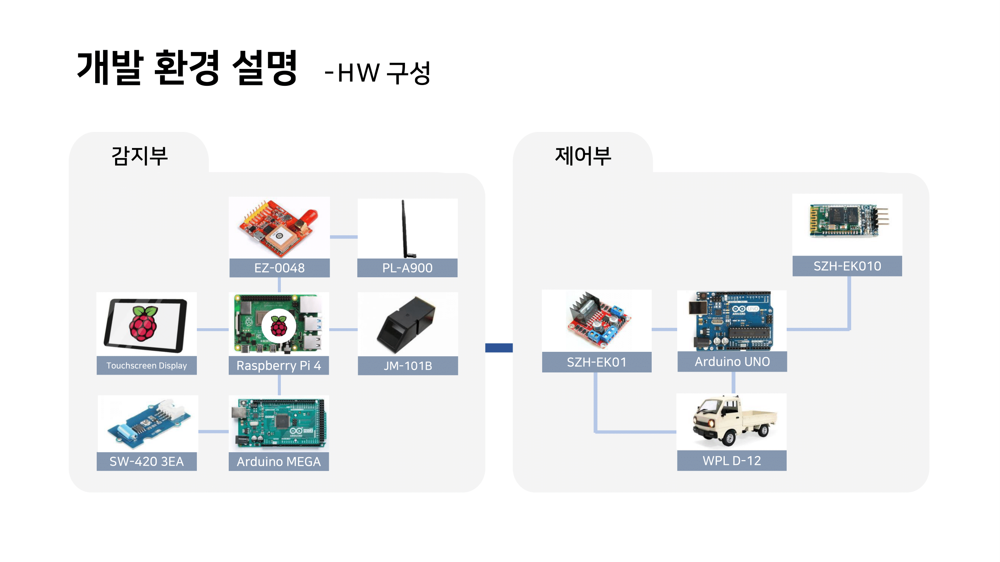
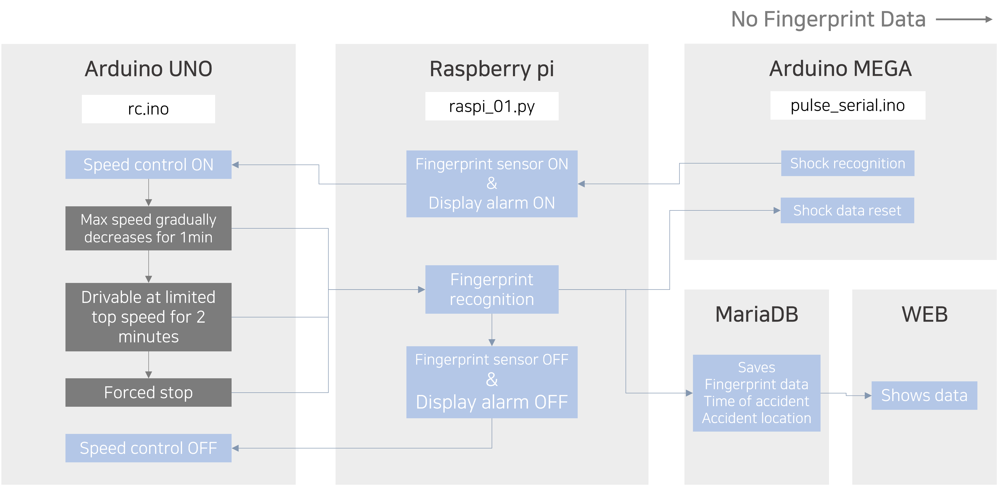

# Team A2B2

## Team Members

| Profile | Mail | Role |
| ------- | ---- | ---- |
| 
 <b>지민영</b></a>
 | adamminyoung@konkuk.ac.kr | 기획 및 총괄 S/W개발 - 충격 감지 후 RasberryPi 동작 개발 H/W개발 - 충격 감지용 Arduino Mega 개발 |
| 
 <b>윤지민</b></a>
 | ske0910@konkuk.ac.kr | S/W개발 - 속도 제어 알고리즘 아이디어 및 구현 H/W개발 - RC카 제어용 Arduino Uno 개발 |
| 
 <b>이소은</b></a>
 | sy3048@konkuk.ac.kr | S/W개발 - RasberryPi 동작 개발 H/W개발 - RC카 제어용 Arduino Uno 개발 Web개발 - Flask 이용 지문인식 데이터 Web에 업로드 |
| 
 <b>차서연</b></a>
 | chasy0826@konkuk.ac.kr | H/W개발 – RC카 제어용 Arduino Uno 개발 |

## GitHub Tree

📦2023ESWContest_free_1017  
 ┣ 📂ArduinoMega  
 ┃ ┗ 📜test.ino  
 ┣ 📂ArduinoUno  
 ┃ ┗ 📜test.ino  
 ┣ 📂RasberryPi  
 ┃ ┗ 📜raspi01.py  
 ┣ 📂Web  
 ┃ ┗ 📜test.ino  
 ┣ 📂imgs  
 ┃ ┣ 🖼️func_spec.png  
 ┃ ┗ 🖼️system_config.png  
 ┣ 🖼️A2B2.png   
 ┗ 📜README.md

## System Configuration

## Functional Specification

## Differentiation of Development

### Safety-Conscious System
In the case of the existing hit-and-run prevention system, the car stopped immediately when an impact was detected. However, through continuous meetings, our team thought that sudden stops on the road could interfere with traffic flow and cause accidents. To solve this problem, we designed a brand-new system to gradually lower the maximum speed of the car and stop if fingerprint recognition is not performed for a certain period of time.

### Revolutional Way of Extracting Driver's Information
The hit-and-run prevention system developed so far has used methods such as dropping license plates on the roadway or dropping the car's RFID chip when shock is detected. However, leaving objects on the roadway can affect the safety of other drivers, and there is a risk of being lost depending on weather conditions. Accordingly, our system allows the driver's information, collision time, and collision place to be extracted through fingerprint recognition.

## Todos

- Add comparing process with MariaDB's fingerprints of suspect
- RasberryPi/raspi01.py code optimization
