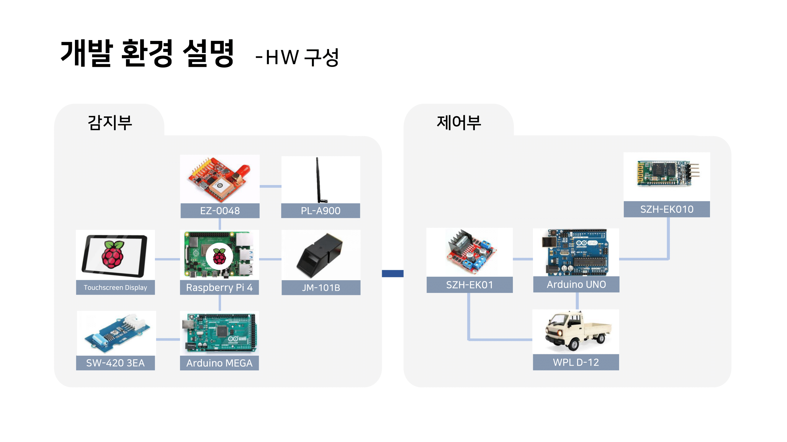
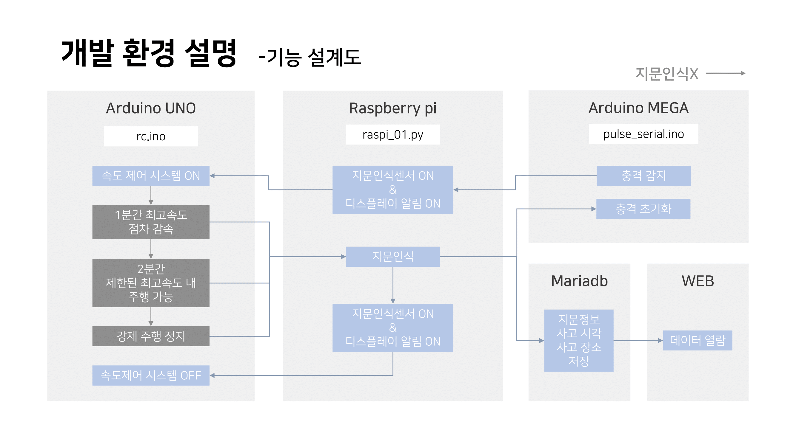

# Team A2B2

## Team Members

| Profile | Mail | Role |
| ------- | ---- | ---- |
| 
 <b>지민영</b></a>
 | adamminyoung@konkuk.ac.kr | 기획 및 총괄 S/W개발 - 충격 감지 후 RasberryPi 동작 개발 H/W개발 - 충격 감지용 Arduino Mega 개발 |
| 
 <b>윤지민</b></a>
 | ske0910@konkuk.ac.kr | S/W개발 - 속도 제어 알고리즘 아이디어 및 구현 H/W개발 - RC카 제어용 Arduino Uno 개발 |
| 
 <b>이소은</b></a>
 | sy3048@konkuk.ac.kr | S/W개발 - RasberryPi 동작 개발 H/W개발 - RC카 제어용 Arduino Uno 개발 Web개발 - Flask 이용 지문인식 데이터 Web에 업로드 |
| 
 <b>차서연</b></a>
 | chasy0826@konkuk.ac.kr | H/W개발 – RC카 제어용 Arduino Uno 개발 |

## GitHub Tree

📦2023ESWContest_free_1017  
 ┣ 📂ArduinoMega  
 ┃ ┗ 📜test.ino  
 ┣ 📂ArduinoUno  
 ┃ ┗ 📜test.ino  
 ┣ 📂RasberryPi  
 ┃ ┗ 📜raspi01.py  
 ┣ 📂Web  
 ┃ ┗ 📜test.ino  
 ┣ 🖼️A2B2.png   
 ┗ 📜README.md

## System Configuration

## Functional Specification

## 개발결과물의 차별성

### 안전을 고려한 시스템
기존의 뺑소니 방지 시스템의 경우, 충격이 감지되면 차를 바로 정차하였다. 하지만 우리 팀은 지속적인 회의를 통해 차도에서의 급정차는 교통의 흐름을 방해하고 오히려 사고를 유발할 수 있을 것이라고 생각했고, 이를 해결하기 위해 차의 최고 속도를 점점 낮추고, 일정 시간동안 지문인식이 되지 않을 경우 차가 정차하도록 시스템을 설계하였다.

### 새로운 형식의 운전자 정보 추출
지금까지 개발된 뺑소니 예방 시스템은 운전자의 정보를 확보하기 위해 차도에 번호판을 떨어뜨리거나, 충격 감지 시 차의 RFID 칩을 떨어뜨리는 등의 방식을 사용했다. 하지만 차도에 물체를 남기는 경우 다른 운전자의 안전에 영향을 줄 수 있고, 기상 상황에 따라 유실될 위험성이 있다. 이에 우리 시스템은 지문 인식을 통해 운전자의 정보와 충돌 시간, 충돌 장소를 추출하도록 했다.

## Todos

- 용의자 검거 시 MariaDB의 지문과 대조하는 과정 추가
- RasberryPi/raspi01.py 코드 최적화
