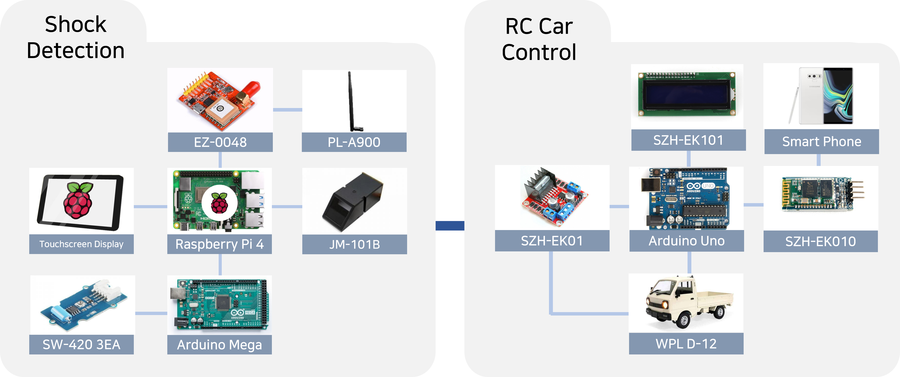
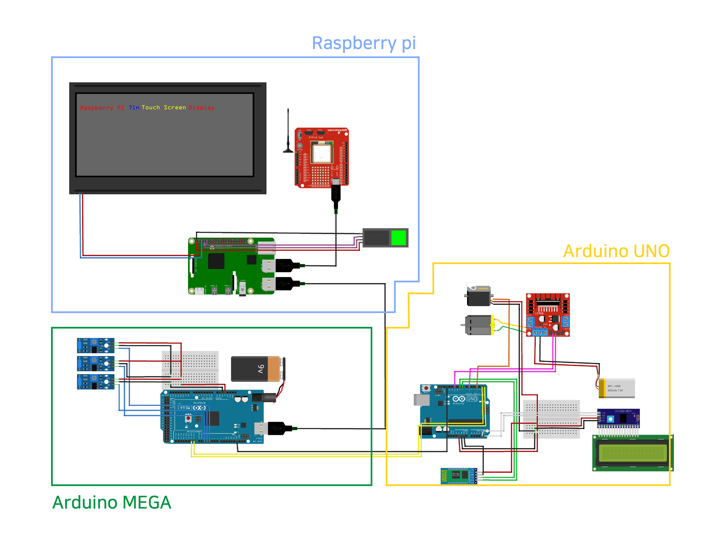

# Team A2B2

## BoongBoong-E

## System Functionality
Our system has been designed to prevent driver escapes in the event of a hit-and-run accident. If an impact occurs while the vehicle is in motion, our system gradually reduces the car's max speed for a duration of 1 minute. After max speed has been reduced, the car can continue operating, not exceeding the reduced top speed for 2 minutes. By this algorithm we can ensure that the flow of surrounding traffic is not disrupted and the potential for accidents is minimized. However, if the driver does not undergo fingerprint recognition even after total 3 minutes, the car is programmed to come to a complete stop. Through this system, we anticipate a society where hit-and-run accidents are eradicated.

## System Configuration

## Functional Specification

## Hardware Diagram

## Competitive Differentiation of Development

### Safety-Conscious System
In the case of the existing hit-and-run prevention system, the car stopped immediately when an impact was detected. However, through continuous meetings, our team thought that sudden stops on the road could interfere with traffic flow and cause accidents. To solve this problem, we designed a brand-new system to gradually lower the maximum speed of the car and stop if fingerprint recognition is not performed for a certain period of time.

### Innovatary Method Extracting Driver's Information
The hit-and-run prevention system developed so far has used methods such as dropping license plates on the roadway or dropping the car's RFID chip when shock is detected. However, leaving objects on the roadway can affect the safety of other drivers, and there is a risk of being lost depending on weather conditions. Accordingly, our system allows the driver's information, collision time, and collision place to be extracted through fingerprint recognition.

## GitHub Tree

📦2023ESWContest_free_1017  
 ┣ 📂ArduinoMega  
 ┃ ┗ 📜test.ino  
 ┣ 📂ArduinoUno  
 ┃ ┗ 📜rc.ino  
 ┣ 📂RasberryPi  
 ┃ ┗ 📜raspi01.py  
 ┣ 📂Web  
 ┃ ┗ 📜test.ino  
 ┣ 📂imgs  
 ┃ ┣ 🖼️func_spec.png  
 ┃ ┣ 🖼️hardware_diagram.png  
 ┃ ┗ 🖼️system_config.png  
 ┣ 🖼️A2B2.png   
 ┗ 📜README.md

## Team Introduction
We are a team of four students majoring in Electrical and Electronic Engineering at Konkuk University, Seoul, South Korea. We are interested in the collaborative relationship between embedded software and the industry.

## Team Members

| Profile | Position | Contact | Role |
| ------- | -------- |---- | ---- |
| 
 <b>Minyoung Ji</b></a>
 | 
Team Leader | 
adamminyoung@konkuk.ac.kr | Planning and General Management S/W Development - Development of RasberryPi Behavior after Shock Detection H/W Development - Development of Arduino Mega for Shock Detection |
| 
 <b>Jimin Yoon</b></a>
 | 
Team Member | 
ske0910@konkuk.ac.kr | S/W Development - Speed Control Idea Devising and Implementation H/W Development - Development of Arduino Uno for RC Car Control |
| 
 <b>Soeun Lee</b></a>
 | 
Team Member | 
sy3048@konkuk.ac.kr | S/W Development - Development of RasberryPi Behavior after Shock Detection H/W Development - Development of Arduino Uno for RC Car Control Web Development - Uploading Fingerprint Recognition Data to Web using Flask |
| 
 <b>Seoyeon Cha</b></a>
 | 
Team Member | 
chasy0826@konkuk.ac.kr | H/W Development - Development of Arduino Uno for RC Car Control |

## Todos

- Add comparing process with MariaDB's fingerprints of suspect
- Optimize RasberryPi/raspi01.py
